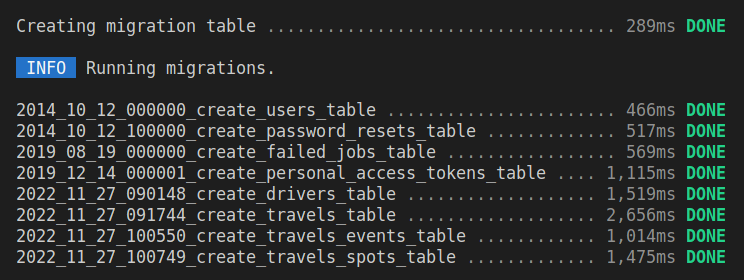
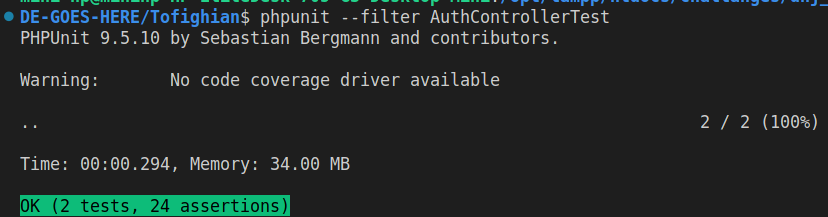
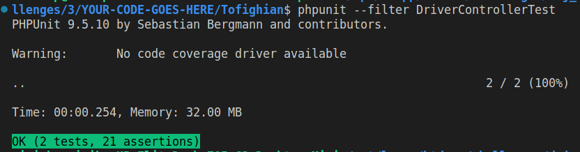
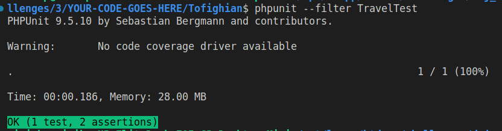
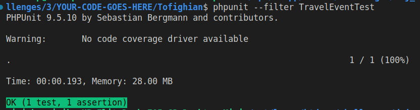
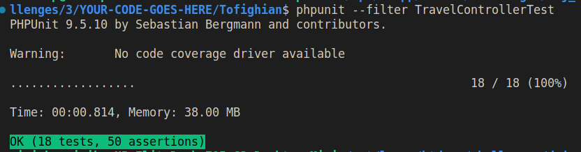
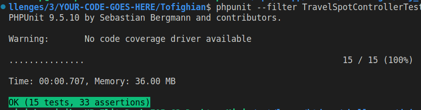
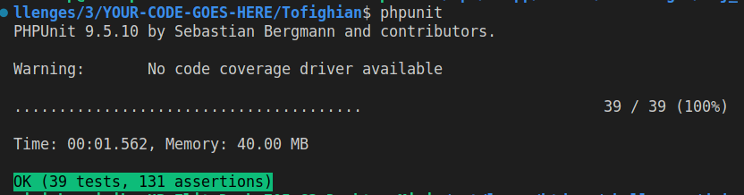

## Descriptions
The current codebase is provided by **DADEH NEGAR JEI**, and it was my job to use provided tests, in order to write appropriate code for models, controllers, requests, resources, etc.

The main project, tries to model an **ONLINE TAXI PLATFORM**, and the provided codebase (models, tests, ...) are very well-written, high-quality, and enlightening. I am peroud to participate in this task.

## Steps
To know more about my thinking style and steps I make to do the task gradually, you can read [Steps.md](./docs/Steps.md). 
The file is very verbose and detailed and persents my **reverse-engineering** skills, which help me to model other ones Ideas and Thoughts.

## Concerns, to-dos, and Ideas
There is also another file named [todo.md](./docs/todo.md) that consists of issues that I have encountered and dealt with. It would be a pleasure for me, if anybody can read it and addresses the mentioned issues.

## environment
I used below tools to finish the task:
- **VSCode**: as code editor
- **Docker**: I dockerized my work with my own docker configurations as below:
    - apche2
    - php8.1
    - mysql8.0.27
    - composer , ...
- **Ubuntu 22**: as OS.
- **GIT** as my main version controller.
- **PHPUnit 9.5.10** as the testing tool.

## Reports
here are reports that confirmes the fulfillment of the task. The needed files could be found in **docs** directory. 

1) successful database migration:

2) passing ```AuthControllerTest```, successfully 

3) passing ```DriverControllerTest```, successfully 

4) passing ```TravelTest```, successfully 

5) passing ```TravelEventTest```, successfully 

6) passing ```TravelControllerTest```, successfully 

7) passing ```TravelSpotControllerTest```, successfully 

8) **passing all tests, successfully**


## FINAL WORDS
That is about it. There are some concerns in my implementation that i stated in the todo.md. Also there are lots fields of imporvment like: 

- DRY-ing my code, 
- Using some service providers, 
- Using a lot of repositories and interfaces.
- Using code documenting tools like phpDocs. 

Please note that my coding style differs based on:
- **codebase**, 
- **project requirments**, and 
- **available time-budget**. 

Here I present my thinking style when I try to **turn designed tests to the program logic**, or better said, my **reverse-engineering skills**. Also it presents my sweet **addiction for documenting** my work. But it is not presenting my problem solving skills, my passion to work as a team memeber, and my love to discuss and cooperate in problem solving sessions.

**Regards and peace out everybody**, ```Ali``` :D